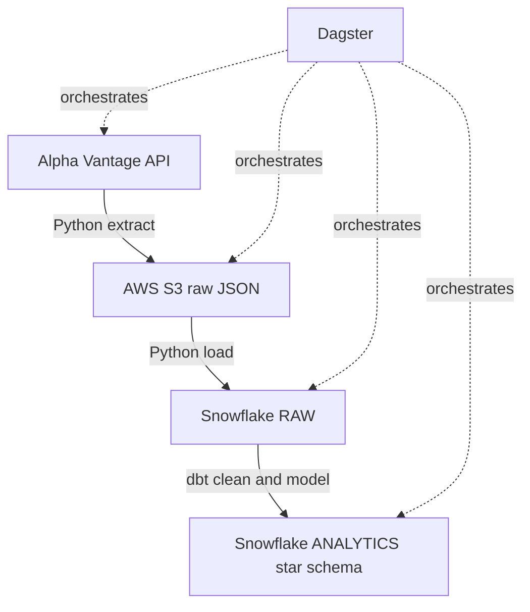
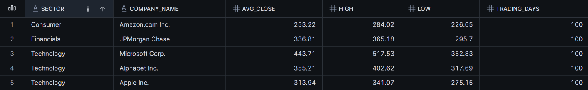

# Market Data Pipeline

A daily pipeline that pulls stock prices from an API, stores them in the cloud, loads them into a warehouse, and models them into clean tables ready for analysis. It runs on a schedule and is built to be re-run safely.

Python handles the extraction, AWS S3 stores the raw data, Snowflake is the warehouse, dbt handles the transformations, and Dagster runs the whole thing.

## Architecture

The data moves through three layers following the medallion pattern.

- Bronze is the raw data, landed in S3 and loaded into Snowflake's RAW schema untouched.
- Silver is a cleaned, typed staging model built by dbt.
- Gold is the final star schema that gets queried.

## Data model

The gold layer is a star schema with one fact table and two dimensions.

- `fact_daily_prices` has one row per ticker per trading day with open, high, low, close, volume, and the day-over-day price change.
- `dim_ticker` maps each ticker to its company name and sector.
- `dim_date` breaks each date into year, month, and weekday.

Prices live in the fact table and the descriptive details live in the dimensions, joined when needed. Here is a query that joins all three to get average closing price by company and sector.

## Reliability

- The load is idempotent. It deletes a ticker's existing rows before inserting the fresh pull, so running twice gives the same result with no duplicates. S3 uses dated filenames, so a re-run overwrites the day's files instead of adding copies.
- The extract step retries automatically on failure.
- dbt runs tests on every build: not-null checks, a referential integrity check between the fact and dimension, a custom test that no price is zero or negative, and a custom test that no ticker-date pair appears twice.
- If the API returns a rate-limit notice instead of data, the pipeline stops with a clear error and the later steps don't run.

## Orchestration

Dagster runs the full pipeline as a connected graph of assets, in order, with retries on the extract step and a daily schedule.

## Stack

| Stage | Tool |
|-------|------|
| Extract | Python (requests) |
| Raw storage | AWS S3 |
| Warehouse | Snowflake |
| Transform | dbt |
| Orchestration | Dagster |

dbt connects to Snowflake with key-pair auth and the Python load uses a programmatic access token, both of which work with Snowflake's MFA requirement.

## Running it

Requires free accounts for Alpha Vantage, Snowflake, and AWS, and Python installed.

1. Clone the repo and create a virtual environment.
2. Install dependencies with pip.
3. Copy `.env.example` to `.env` and fill in your credentials.
4. Create the Snowflake database, schemas, and warehouse.
5. Run it through Dagster with `dagster dev`, or run the scripts individually.

The `.env` file holds all credentials and is not committed. `.env.example` shows which values are needed.

## Possible improvements

- Switch the load to a MERGE on ticker and date so the warehouse keeps full history instead of mirroring the API's rolling 100-day window.
- Load into Snowflake with COPY INTO from an S3 stage instead of going through pandas.
- Add a source freshness check and a Dagster asset check that fails if no new data lands.
- Containerize with Docker.
- Move off the free API tier, which caps at 25 requests a day.